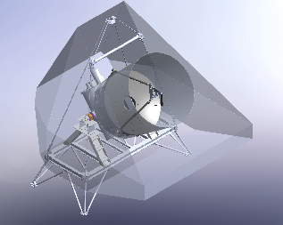

# Terahertz Intensity Mapper (TIM) flight and ground operations code

## What is TIM?

The [Terahertz Intensity Mapper (TIM)](https://arxiv.org/ftp/arxiv/papers/2009/2009.14340.pdf) experiment is a stratospheric balloon for studying the star formation history of the universe via [line intensity mapping](https://arxiv.org/pdf/1903.04496.pdf).

It is a cryogenically cooled 2.5m telescope sensitive to the far-IR wavelength range of the electromagnetic spectrum, and observes a patch of sky to measure the 3D spatial distribution of molecular gas via emission line tracers of star formation such as [CII], [NII], and [OIII]. To do this, it flies above most of the atmosphere in a gondola suspended under a balloon.

See the [subsystem summary](./docs/SubsystemSummary.md) for a simplified overview of the balloon's software subsystems.
